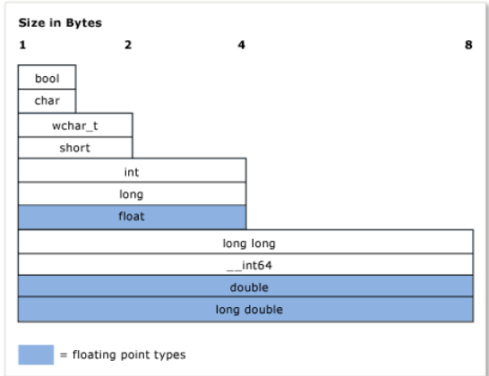

# C++ 자료형 체계

C++에서 자료형의 개념은 중요하다. 모든 변수, 함수의 인수, 그리고 반환값은 컴파일되기 위해 반드시 자료형을 가져야 한다. 

또한, (리터럴 값을 포함한)모든 표현들은 그들이 평가되기 전 컴파일러에 의해 암묵적으로 자료형을 받는다. 

몇몇 예시들
- 정수 값을 저장하기 위한 `int`형
- 부동 소수점 값을 저장하기 위한 `double`형같은 내장 자료형
- 텍스트 저장을 위한 클래스인 <std::basic_string>과 같은 표준 라이브러리 자료형.

`class`나 `struct`를 정의하여 사용자 스스로 자료형을 만들 수도 있다.

자료형은 그 변수(또는 표현의 결과)를 위해 할당될 메모리의 양을 지정한다. 물론 저장될 값의 종류도 특정하고, 컴파일러가 그 값의 비트 패턴을 어떻게 해석할지, 그리고 그것들에 대해 할 수 있는 연산이 무엇인지도 특정한다.

---

## 용어 정리

**스칼라형(Scalar Type)**:
- 정의된 구간의 단일 값을 가진 자료형.
- 산술 자료형, 반복 자료형, 포인터 자료형, 포인터-멤버 자료형, 그리고 `std::nullptr_t`도 포함한다. 
- 기본(내장) 자료형들은 주로 스칼라형이다. 

**복합형**:
- 스칼라형이 아닌 자료형이다. 
- 배열형, 함수형, 클래스나 구조체, 유니온형, 반복형, 참조형, 그리고 비-정적 클래스 멤머에 대한 포인터를 포함한다.

**변수**:
- 데이터의 기호적 명칭이다.
- 그 명칭이 정의된 곳의 스코프 내에서 데이터에 접근하기 위해 사용될 수 있다.
- C++에서, 변수는 주로 스칼라형의 인스턴스를 지칭하고, 반면 다른 경우엔 *객체*라고 불린다.

**객체**:
- 이 문서에선 단순함과 일관성을 위해 클래스나 구조체의 모든 인스턴스를 *객체*로 지칭한다. 

**POD(plain old data)형**:
- C++에서 이 비공식적 자료형의 범주는 스칼라나 *POD 클래스*인 자료형들을 지칭한다.
- POD 클래스는 POD가 아닌 정적 데이터 멤버가 없고, 사용자 정의 생성자와 소멸자, 또는 사용자 정의 할당 연산자도 없다. 
- POD 클래스는 가상 함수가 없고, 기본 클래스도 없고, 보호된 비-정적 데이터 멤버도 없다.
- POD형은 C 언어로 쓰인 모듈로 작업할 때와 같이 같이 외부 데이터 교환을 위해 자주 쓰인다. 

---

## 변수와 함수의 자료형 지정하기

C++은 강하게 형식화된 언어이자 정적으로 형식화된 언어이다.  
모든 객체는 자료형이 있으며 그 자료형은 절대 변하지 않는다.  

C++ 코드에서 변수를 선언할 때, 그것의 자료형을 명시적으로 지정하거나, `auto` 키워드를 사용하여 컴파일러가 초기 설정에서 자료형을 추론하도록 해야 한다. 마찬가지로 함수를 선언할 때에도 반환값과 각 인수의 자료형을 지정해야 한다. 함수에 반환값이 없을 경우에는 반환값의 자료형을 `void`로 하면 된다. 예외는 함수 템플릿을 사용할 때로, 템플릿은 인수에 임의의 자료형을 허용한다.

일단 한 번 변수를 선언하고 나면 나중에 자료형을 바꿀 수가 없다. 하지만, 변수의 값이나 함수의 반환값을 다른 자료형의 다른 변수에 복사할 수 있다. 그런 연산은 *자료형 변환*이라고 불리는데, 가끔 필요하지만 잠재적으로 데이터를 잃거나 값이 부정확해지는 원인이기도 한다.

POD형의 변수를 선언할 때에는 *초기화*를 하는 것이 강력히 추천된다.  
초기화 전까지 POD 변수는 그 메모리 위치에 이전에 존재했던 비트들로 구성된 "쓰레기" 값을 가지고 있다. 이건 기억해야 할 C++의 중요한 측면으로, 특히 사용자를 위해 초기화를 관리해주던 다른 언어에서 이주하였을 때 더욱 중요하다. 비-POD 클래스 자료형의 변수를 선언할 경우, 생성자가 초기화를 담당한다.

예제:
```C++
int result = 0; // 정수 변수 선언, 정수로 초기화
double coefficient = 10.8; // 실수 변수 선언 및 초기화

auto name = "Lady G."; // 컴파일러가 자동으로 자료형을 추론하게 함
auto address; // 오류. 초기값 없이 컴파일러가 자료형을 추론할 수 없음.
age = 12; // 오류. 변수 선언은 무조건 자료형을 지정하거나 auto를 사용해야 함.

result = "Kenny G."; // 오류. 텍스트를 정수 변수에 할당할 수 없음.
string result = "zero"; // 오류. 새로운 자료형으로 변수를 재정의할 수 없음.

int maxValue; // 비추천! 이 maxValue 변수는 초기화 전까지 쓰레기 비트를 담고 있을 것임.
```

---

# 기본(내장) 자료형들

C++에는 다른 모든 자료형이 도출된 전역 기본 자료형이 없다. 이 언어는 많은 *기본 자료형* 또는 *내장 자료형*으로 알려진 것들을 가지고 있다. 

이 자료형들은 `int`, `double`, `long`, `bool`과 같은 수치 자료형에 더해, 각각 ASCII와 UNICODE 문자들을 위한 `char`과 `wchar_t` 자료형도 포함한다. 

대부분의 정수형 기본 자료형(`bool`, `double`, `wchar_t`와 관련된 자료형들은 제외)들은 변수가 저장할 수 있는 값의 범위를 조정하는 `unsigned`된 버전을 가지고 있다. 정수형은 $[-n,n]$와 같이 0을 기준으로 대칭적인 범위를 가지는데, `unsigned`를 하면 $[0,2n]$으로 양수 범위에 완전히 몰아진다. 가능한 값의 개수는 동일하지만 구간만 다르다.

내장 자료형의 상대적인 메모리 크기 차이:


가장 자주 쓰이는 기본 자료형과 그 크기:

|**Type**|**Size**|**Comment**|
|--------|-----|----|
|`int`|4 바이트|정수 값의 기본 선택지|
|`double`|8 바이트|부동소수점 값의 기본 선택지|
|`bool`|1 바이트|참이거나 거짓일 수 있는 값을 표현|
|`char`|1 바이트|낡은 C-스타일 문자열의 ASCII 문자나 절대로 UNICODE로 변환될 필요가 없는 `std::string` 객체에 쓰인다.|
|`wchar_t`|2 바이트|UNICODE 형식으로 인코딩될 수도 있는 "넓은(wide)" 문자 값을 표현한다. 이 `wchar_t`는 `std::wstring` 자료형의 문자열에 쓰이는 문자 자료형이다.|
|`unsigned char`|1 바이트|C++은 내장 바이트형이 없다. 바이트 값을 표현하기 위해 이 `unsigned char`를 사용한다.|
|`unsigned int`|4 바이트|비트 플래그를 위한 기본 선택지.|
|`long` `long`|8 바이트|훨씬 더 큰 범위의 정수값을 표현.|

---

## `const`: 자료형 한정자
`const` 키워드를 통해 어떤 내장 또는 사용자 정의 자료형도 한정될 수 있다. 더욱이, 멤버 함수는 "상수로 제한"되거나 심지어 "상수로 오버로딩"될 수도 있다. `const` 자료형의 값은 초기화 이후 변경될 수 없다.

```C++
const double PI = 3.1415;
PI = .75 //오류. 상수 변수는 수정할 수 없음.
```

`const` 한정자는 함수와 변수 선엔에서 널리 사용되고, 의도치 않게 컴파일 시간에 값들이 변하지 않는 것을 보장하기 위해 `const`를 사용하는 개념인 "상수 일관성"은 C++에서 중요한 개념이다.  
그리고 `const` 자료형은 비`const` 버전과는 구분된다. 예를 들어, `const int`는 `int`와는 다르다. 변수로부터 *상수성*을 제거하고 싶은 드문 상황에선 C++의 `const_cast` 연산자를 사용하면 된다. 

---

## 포인터 자료형
포인터 자료형은 실제 데이터가 저장된 메모리 위치의 주소를 저장한다.  
현대의 C++에서, 이러한 포인터 자료형들은 *원시 포인터*로 지칭되며, 그것들은 `*`나 `->`와 같은 특별한 연산자를 통해 접근된다. 이 메모리 접근 연산은 *역참조*라고 불린다. 

하지만, 현대의 C++에서는 <스마트 포인터>의 진화로 인해 원시 포인터를 객체 소유권을 위해 사용하는 것이 전혀 요구(또는 권장)되지 않는다. 객체를 관찰하기 위해 원시 포인터를 사용하는 것은 여전히 유용하고 안전하다. 하지만, 그걸 객체 소유권을 위해 사용한다면, 객체가 어떻게 소유되고 생성되고 소멸하는지에 대해 조심스럽게 고려해야 하고 주의해야 한다.

원시 포인터 변수 선언은 주소를 저장하기 충분한 메모리만 할당한다. 포인터 선언은 데이터 값을 저장하기 위해 필요한 메모리를 할당하지 않는다. 달리 말해, 원시 포인터 변수를 선언함은 메모리 주소 변수를 만드는 것이고, 실제 데이터 변수는 만들어지지 않는다. 만약 데이터 값을 저장한 유효한 주소를 담고 있음이 확인되지 않은 상태로 포인터 변수를 역참조할 경우, 프로그램은 미정의된 행동(주로 심각한 오류)를 유발한다. 

```C++
int* pNumber;//정수 메모리를 참조하는 포인터 변수
*pNumber = 10; //오류. 컴파일은 될 수도 있지만, 심각한 오류임.
//포인트할 할당된 메모리 없이 미초기화된 포인터 변수를 역참조하면 안 됨.
```
이 예제는 실제 정수 데이터를 저장하기 위해 할당된 어떠한 메모리나 배정될 유효한 메모리 주소가 없는 포인터 자료형을 역참조한다. 아래와 같이 주소를 제대로 할당해야 오류가 수정된다.

```C++
int number = 10;//실제 데이터가 저장된 지역 정수 변수를 선언 및 초기화

int* pNumber = &number;//유효한 메모리 주소에 지역 정수 포인터 변수를 선언 및 초기화

*pNumber = 41;//pNumber로 포인트된 메모리를 역참조하고 거기에 새로운 값을 저장. 변한 것은 실제 값을 저장하고 있는 "number"이지 주소를 저장하고 있는 "pNumber"가 아님에 주의.
```

수정된 코드는 `pNumber`가 포인트할 실제 값이 저장된 메모리 주소를 만들기 위해 로킬 스택 메모리를 사용한다. 실제로는, 포인터를 위한 실제 데이터의 주소는 대체로 `new` 키워드 표현을 통해 *힙*이라고 불리는 메모리 공간에 동적으로 할당되는, 사용자 정의 자료형들이다. 한 번 할당되고 나면, 이 변수들은 일반적으로, 특히 클래스 정의에 기초할 때 *객체*로 지칭된다. `new`로 할당된 메모리는 반드시 대응되는 `delete`문으로 삭제되어야 한다.

```C++
#include <memory>

using namespace std;

void someFunction() {
    unique_ptr<MyClass> pMc(new MyClass);
    pMc->DoSomeWork();
}
//메모리 누수 없음. unique_ptr 클래스를 사용하면 스코프에서 나가는 순간 자동으로 소멸자가 호출되어 리소스가 제외됨.
```